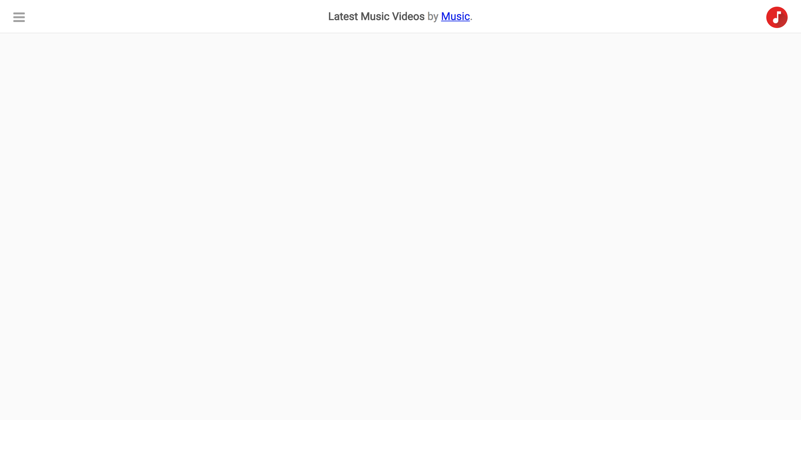

# YouTube Navbar

## Steps

- Fork the next [pen](https://codepen.io/muktek/pen/MQjrEQ) into your Codepen account.

**Don’t touch the HTML. You can only add classes to existing elements.**

## What’s the deal

- You are using [Font Awesome Icons](https://fontawesome.com/icons) to render “X” icon, please read the documentation to render the correct one, see illustration. The syntax to render an icon using that library is: `fa fa-iconName`.

## Design Specs

```
General
  “Roboto” as main font family.
  fill color: rgb(250, 250, 250)
Navbar
  fill color: white
  text color: rgb(136, 136, 136)
  space between content and border: 15px only for top and bottom, rest is 0
  border color: EAEAEA
Music Icon
  Dimensions: 32px * 32px
  Aligned 10px to the top and 20px to the right
Wrong Icon
  text size: 20px
  Aligned 16px to the top and 20px to the left
  color: rgba(17, 17, 17, 0.4)
Text
  should be centered
```

## Final Result


